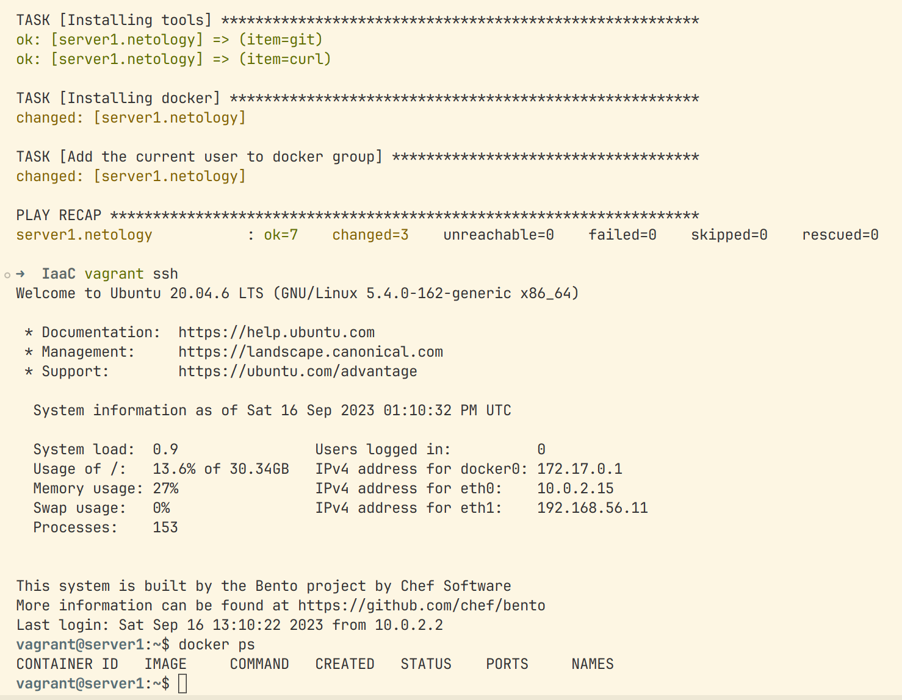

# Задача 1

Опишите основные преимущества применения на практике IaaC-паттернов.
Какой из принципов IaaC является основополагающим?

## Ответ

- Автоматизация инфраструктуры: Использование IaaC (Infrastructure as Code) позволяет 
автоматизировать процесс развертывания и управления инфраструктурой. Вместо ручного настройки и 
конфигурирования серверов и сервисов, можно использовать код. Это позволяет снизить вероятность 
ошибок и обеспечить повторяемость и надежность процесса.

- Гибкость и масштабируемость: IaaC позволяет легко масштабировать инфраструктуру в зависимости от 
потребностей. Это также позволяет быстро адаптироваться к изменяющимся требованиям бизнеса.

- Управление версиями и отслеживание изменений: Использование IaaC позволяет управлять версиями 
инфраструктурного кода и отслеживать изменения.

- Документирование и совместная работа: IaaC-код является документацией самой инфраструктуры. Он 
описывает требуемые ресурсы, настройки и зависимости. Это упрощает командную работу и обеспечивает 
единое понимание инфраструктуры у всех участников проекта.

- Повторяемость и воспроизводимость: IaaC позволяет легко воспроизводить инфраструктуру в различных 
средах, таких как разработка, тестирование и продуктивная среда.

Основополагающим принципом IaaC является принцип описания инфраструктуры в виде кода. 
Это подразумевает использование кода для создания, настройки и управления инфраструктурой, включая 
серверы, сети, хранилища данных и другие ресурсы.


# Задача 2

Чем Ansible выгодно отличается от других систем управление конфигурациями?
Какой, на ваш взгляд, метод работы систем конфигурации более надёжный — push или pull?

## Ответ

Ansible имеет легкий порог входа в использование. Нет необходимости устанавливать агента на узлы. Он 
использует SSH-протокол для взаимодействия с удаленными узлами.  Ansible позволяет управлять как 
небольшими, так и крупными инфраструктурами. Он поддерживает параллельное выполнение задач на 
нескольких узлах, что позволяет ускорить процесс управления конфигурацией.
Ansible имеет широкую экосистему модулей, ролей и плагинов, которые позволяют автоматизировать 
различные задачи и интегрироваться с различными технологиями. Кроме того, Ansible имеет активное 
сообщество пользователей и разработчиков, которые предоставляют поддержку, документацию и 
обновления.

Какой, на ваш взгляд, метод работы систем конфигурации более надежный — push или pull?
Метод работы системы конфигурации, будь то push или pull, зависит от конкретных потребностей и 
предпочтений организации. 
- Push-модель: В push-модели система конфигурации активно отправляет и 
применяет изменения на управляемые узлы. Этот подход может быть полезен, когда вам необходимо быстро 
и одновременно применить изменения на нескольких узлах. 

- Pull-модель: В pull-модели управляемые узлы активно запрашивают и применяют изменения из системы 
конфигурации. Он также может быть полезен, когда у вас есть узлы, которые могут быть доступны 
только в определенные моменты времени или имеют ограниченную пропускную способность сети.


# Задача 3

```bash

sudo pamac install virtualbox                                                                        
      
[sudo] пароль для vda: 
Подготовка...
Внимание: virtualbox-7.0.10-2 не устарел -- пропускается
Нет заданий.
Транзакция успешно завершена.

```

```bash
sudo pamac install vagrant
Подготовка...
Внимание: vagrant-2.3.7-1 не устарел -- пропускается
Нет заданий.
Транзакция успешно завершена.
```

```bash
sudo pamac install terraform
Подготовка...
Внимание: terraform-1.5.6-1 не устарел -- пропускается
Нет заданий.
Транзакция успешно завершена.
```

```bash

pip install ansible
Requirement already satisfied: ansible in ./ansible-2.9/lib/python3.11/site-packages (8.3.0)
Requirement already satisfied: ansible-core~=2.15.3 in ./ansible-2.9/lib/python3.11/site-packages 
(from ansible) (2.15.3)
Requirement already satisfied: jinja2>=3.0.0 in ./ansible-2.9/lib/python3.11/site-packages (from 
ansible-core~=2.15.3->ansible) (3.1.2)
Requirement already satisfied: PyYAML>=5.1 in ./ansible-2.9/lib/python3.11/site-packages (from 
ansible-core~=2.15.3->ansible) (6.0.1)
Requirement already satisfied: cryptography in ./ansible-2.9/lib/python3.11/site-packages (from 
ansible-core~=2.15.3->ansible) (41.0.3)
Requirement already satisfied: packaging in ./ansible-2.9/lib/python3.11/site-packages (from 
ansible-core~=2.15.3->ansible) (23.1)
Requirement already satisfied: resolvelib<1.1.0,>=0.5.3 in 
./ansible-2.9/lib/python3.11/site-packages (from ansible-core~=2.15.3->ansible) (1.0.1)
Requirement already satisfied: MarkupSafe>=2.0 in ./ansible-2.9/lib/python3.11/site-packages (from 
jinja2>=3.0.0->ansible-core~=2.15.3->ansible) (2.1.3)
Requirement already satisfied: cffi>=1.12 in ./ansible-2.9/lib/python3.11/site-packages (from 
cryptography->ansible-core~=2.15.3->ansible) (1.15.1)
Requirement already satisfied: pycparser in ./ansible-2.9/lib/python3.11/site-packages (from 
cffi>=1.12->cryptography->ansible-core~=2.15.3->ansible) (2.21)

```

# Задача 4


